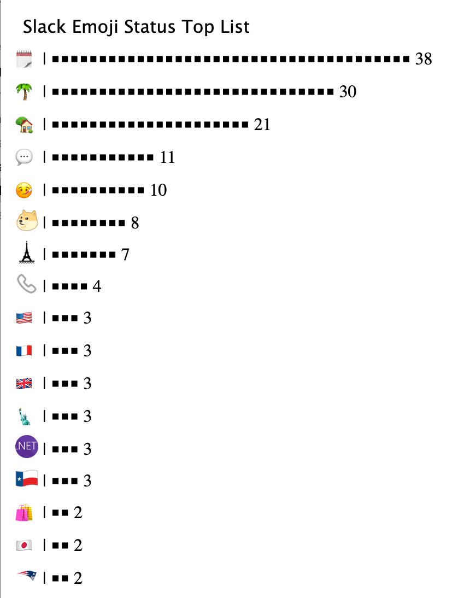
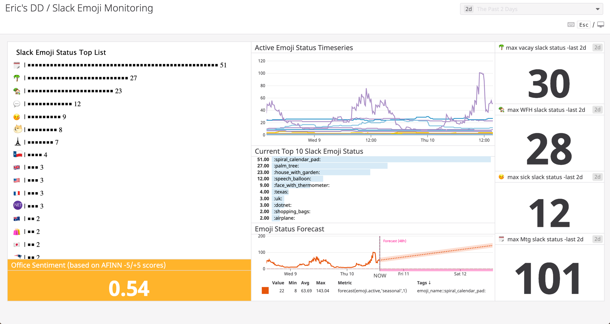

# dd_emoji
dd slack emoji monitoring - a small express application leveraging the slack api, datadog, redis, and a few other free and open source tools to monitor slack emoji status, trends, and sentiment.

### Setup and Installation

- clone this repository and cd into the root of the directory
- `touch .env`
- in the `.env` file, add your SLACK TOKEN (found on slack [here](https://api.slack.com/custom-integrations/legacy-tokens) ) and Redis Host, Port, and Password to the `.env` file. I used the [`RedisToGo`](https://redistogo.com/) free plan, but a local redis server would work fine for development purposes (simply install redis by following the directions [here](https://redis.io/topics/quickstart) and, in another terminal, run `redis-server` to expose redis locally on `localhost:6379` )
- in the `.env` file, add your Datadog `API_KEY` and `APP_KEY` to the `.env` file in this repository. DatadogHQ is a monitoring platform that's free to sign up for at `https://www.datadoghq.com/`.
- in the `.env` file, add your Companies Email Domain. For example `examplecompany.com`, `gmail.com` , `wayneenterprises.com`, `umbrellacorporation.com`, `biffco.com` , `nakatomi-corporation.com`, `stricklandpropane.com` or any other very real company email domain.
- in the `.env` file, indicate an environment for datadog. Do not use `DD_ENV=dev` unless you've read the repository carefully.
- `npm install`
- `npm start`

### Usage

- To collect metrics, make a HTTP `GET` Request to `localhost:3000/?sendMetrics=yes` or wherever your application is hosted (this works great hosted on (`glitch.me`)[glitch.me] ).
- When passing the query string parameter `sendMetrics=yes` in your `GET` Request, this application will generate a `gauge` metric sent to Datadog called `emoji.active` tagged with the `emoji_name` representing the current number of times each emoji is currently being used in slack by an active employee with your company's email domain, including custom emoji. It will also generate the metric `emoji.active_sentiment` , that represented the average sentiment of all your Slack User's Emoji Status, according to the `AFINN-165 wordlist` and `Emoji Sentiment Ranking` scale between `-5 and 5`. You can learn more about this calculation [here](https://github.com/thisandagain/sentiment).
- To generate an HTML report, make a HTTP `GET` Request to `localhost:3000` or wherever your application is hosted.

#### Example HTML Report and Datadog Dashboard

- HTML Report

- Datadog Dashboard

